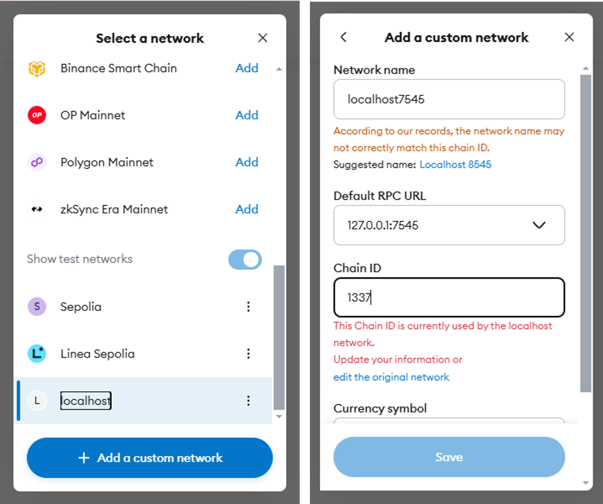

<!-- PROJECT LOGO -->
<p align="center">
  <h1 align="center">Aplikasi Daftar Tugas - Ethereum Blockchain</h1>

  <p align="center">
    Aplikasi pencatatan daftar tugas sederhana menggunakan Ethereum blockchain.
  </p>
</p>


<!-- TABLE OF CONTENTS -->
<details open="open">
  <summary>Daftar Isi</summary>
  <ol>
    <li>
      <a href="#tentang-projek">Tentang Projek</a>
    </li>
    <li>
      <a href="#untuk-memulai">Untuk Memulai</a>
      <ul>
        <li><a href="#perangkat-lunak">Perangkat Lunak</a></li>
        <li><a href="#instalasi">Instalasi</a></li>
      </ul>
    </li>
    <li><a href="#penggunaan">Penggunaan</a></li>
    <li><a href="#kontak">Kontak</a></li>
    <li><a href="#acknowledgements">Acknowledgements</a></li>
  </ol>
</details>


<!-- ABOUT THE PROJECT -->
## Tentang Projek
Salah satu aplikasi pada praktikum Aplikasi pada buku pengantar teknologi blockchain: aplikasi terdistribusi. Aplikasi sederhana ini dapat menyimpan daftar tugas sederhana pada Ethereum blockchain.


<!-- GETTING STARTED -->
## Untuk Memulai

Untuk dapat menjalankan Aplikasi ini pada komputer Anda, diperlukan beberapa perangkat lunak serta langkah instalasinya sebagai berikut:

### Perangkat Lunak

Pada saat pembuatan aplikasi ini, digunakan beberapa perangkat lunak dengan spesifikasi sebagai berikut:
-	Nodejs versi v12.16.3 
-	Npm versi 7.15.1
-	Truffle Framework versi v5.1.45,
-	Ganache sebagai Lokal Ethereum Blockchain,
-	Ethereum wallet seperti metamask.


### Instalasi

1. Download / Clone kode aplikasi projek ini,
   ```sh
   git clone https://github.com/kangPrayit/blockchain-aplikasi-daftar-tugas.git
   ```
3. Install package yang dibutuhkan oleh aplikasi dengan menggunakan perintah:
   ```sh
   npm install
   ```
4. Jalankan aplikasi Ganache
5. Migrasi Smart Contract ke lokal Ethereum Blockchain:
   ```JS
   truffle migrate --refresh
   ```
6. Jalankan aplikasi menggunakan perintah:
   ```JS
   npm run dev
   ```

## Sebelum Penggunaa
sebelum penggunaan pastikan akun metamask memiliki balance!. kita bisa menggunakan akun balance di dalam ganache untuk pengujian. untuk menghubungkan akun balance di ganache dapat melakukan langkah-langkah sebagai berikut:
- Buka aplikasi metamask, kemudian select network dibagian kiri atas. kemudian tambahkan custom network. lanjutkan dengan informasi detail yang ada pada ganache.


- Buka ganache, pilih salah satu akun yang ada pada ganache. buka private key dengan menekan tombol kunci. lalu copy private key nya.


- Kembali lagi ke aplikasi metamask, tambahkan account dengan cara memasukkan private key yang telah di copy.


<!-- USAGE EXAMPLES -->
## Penggunaan
Beberapa langkah penggunaan seperti
- Masukkan nama tugas yang akan dimasukkan kedalam Ethereum blockchain, kemudian tekan tombol enter.


- Setelah tombol enter ditekan, maka akan keluar konfirmasi transaksi data dari Wallet metamask ke Ethereum Blockchain.


- Setelah konfirmasi disetujui maka data tugas yang kita masukkan akan keluar dalam aplikasi.


<!-- CONTACT -->
## Kontak

Prayitno - [@kang_prayit](https://twitter.com/kang_prayit)

Project Link: [https://github.com/kangPrayit/blockchain-aplikasi-daftar-tugas](https://github.com/kangPrayit/blockchain-aplikasi-daftar-tugas)


<!-- ACKNOWLEDGEMENTS -->
## Acknowledgements
* Eko Prasetyo
* Sunardi
